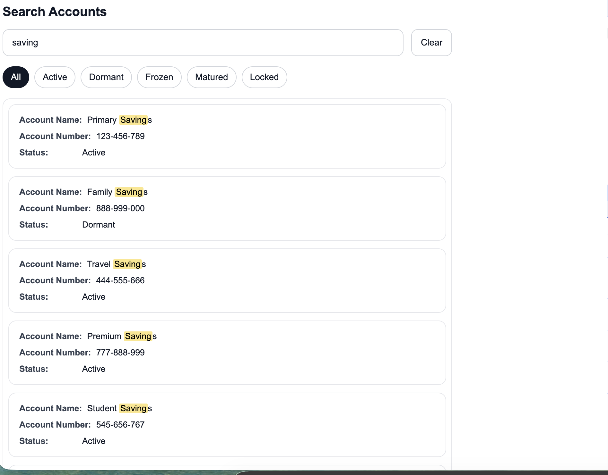

# Search Now Workspace

A monorepo project featuring web components built with Stencil, along with React and Angular wrappers for easy integration.

## Packages

- **ui-core**: Core Stencil web components library
- **react-wrapper**: React wrapper for the core components
- **angular-wrapper**: Angular wrapper for the core components

## Getting Started

1. Install root npm dependencies:
   ```bash
   npm install
   ```

2. Build the Stencil web components (required for the demo app):
   ```bash
   cd packages/ui-core
   npm run build
   ```

   Important: whenever you make changes in `packages/ui-core` web components, run this build step again before testing in `demo-react` or `demo-angular`.

3. Open a new terminal and start the mock server (from the root folder):
   ```bash
   npm run mock:server
   ```

   Mock data can be found in `mock/db.json`.

   This starts a JSON server on http://localhost:3001/ with sample data.

4. Start the demo react app (from the root folder):
   ```bash
   npm run dev --workspace=demo-react
   ```

   The react app will be available at http://localhost:5173/

5. Start the demo Angular app (from the root folder):
   ```bash
   npm run start --workspace=demo-angular
   ```

   **Theme test changes are added to the Angular demo app for testing light and dark theme.**

   The Angular app will be available at http://localhost:4200/

## Development

- The web components in `packages/ui-core` can be built, tested, and run using the following commands:

```bash
cd packages/ui-core
npm run build
npm run test
npm run start
```

### Running Components Separately

For developing the web components independently:

```bash
cd packages/ui-core
npm run start
```

This starts the Stencil development server at http://localhost:3333/

## Using the Components

### In React Applications

Import and use the web components through the React wrapper with a config object:

```tsx
import { SearchNow } from '@search-now/react-wrapper';
import { customerSearchConfig } from './customer-search-config';

function App() {
  const handleResultSelect = (event: CustomEvent) => {
    console.log('Selected search result in react app:', event.detail);
  };

  return (
    <div>
      <SearchNow
        config={customerSearchConfig}
        onResultSelect={handleResultSelect}
      />
    </div>
  );
}
```

### In Angular Applications

Import and use the web components through the Angular wrapper with a config object:

```typescript
import { Component, CUSTOM_ELEMENTS_SCHEMA } from '@angular/core';
import { SearchNow } from '../../../../packages/angular-wrapper/src/directives/proxies';
import { accountSearchConfig } from './account-search-config';

@Component({
  selector: 'app-root',
  imports: [SearchNow],
  schemas: [CUSTOM_ELEMENTS_SCHEMA],
  templateUrl: './app.html',
  styleUrl: './app.scss'
})
export class App {
  readonly accountSearchConfig = accountSearchConfig;

  onResultSelect(event: CustomEvent) {
    console.log('Angular received:', event.detail);
  }
}
```

```html
<search-now
  [config]="accountSearchConfig"
  (resultSelect)="onResultSelect($event)">
</search-now>
```

## Screenshots

### Search Accounts


