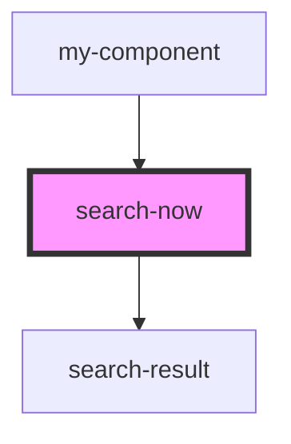

# search-now

<!-- Auto Generated Below -->

## Properties

| Property              | Attribute | Description | Type              | Default     |
| --------------------- | --------- | ----------- | ----------------- | ----------- |
| `config` _(required)_ | --        |             | `SearchNowConfig` | `undefined` |

## Events

| Event          | Description | Type                           |
| -------------- | ----------- | ------------------------------ |
| `resultSelect` |             | `CustomEvent<SearchNowResult>` |

## Dependencies

### Used by

 - [my-component](../my-component)

### Depends on

- [search-result](../search-result)

### Graph

----------------------------------------------

*Built with [StencilJS](https://stenciljs.com/)*
