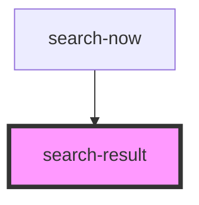

# search-result

<!-- Auto Generated Below -->

## Properties

| Property                | Attribute   | Description | Type                       | Default     |
| ----------------------- | ----------- | ----------- | -------------------------- | ----------- |
| `active`                | `active`    |             | `boolean`                  | `false`     |
| `labels` _(required)_   | --          |             | `SearchResultLabelsConfig` | `undefined` |
| `optionId` _(required)_ | `option-id` |             | `string`                   | `undefined` |
| `query`                 | `query`     |             | `string`                   | `''`        |
| `result` _(required)_   | --          |             | `SearchNowResult`          | `undefined` |

## Dependencies

### Used by

 - [search-now](../search-now)

### Graph

----------------------------------------------

*Built with [StencilJS](https://stenciljs.com/)*
